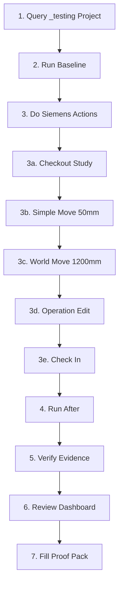

# E2E Validation Pack - Index

**Purpose:** Comprehensive E2E validation suite for proving SimTreeNav evidence system works correctly from Siemens front-end actions through Oracle DB changes to dashboard visualization.

**Status:** ✅ Complete and ready to use

**Date Created:** 2026-01-29

---

## 📚 Documentation Files

### Main Guide
**[E2E_TEST_PROOF_PACK.md](E2E_TEST_PROOF_PACK.md)** - Complete E2E test procedure (6 parts)
- Part 1: Identify study in _testing project
- Part 2: Siemens front-end action script (checkout, moves, operations)
- Part 3: Pre/post SimTreeNav runs
- Part 4: Automated verification checks
- Part 5: Human-readable change explanation
- Part 6: Review dashboard

### Quick Reference
**[E2E_QUICK_REFERENCE.md](E2E_QUICK_REFERENCE.md)** - Copy/paste commands and expected outputs
- All commands in one place
- Expected output samples
- Troubleshooting quick fixes
- Files generated reference

### Proof Pack Template
**[E2E_TEST_PROOF_TEMPLATE.md](E2E_TEST_PROOF_TEMPLATE.md)** - Fillable template for management reporting
- Test summary table
- Siemens UI action checklist (fillable)
- DB evidence correspondence (fillable)
- SimTreeNav event details (fillable)
- "What this proves" section
- Verification results checklist
- Sign-off section

---

## 🔧 PowerShell Scripts

### Tree Snapshot Export Script
**[scripts/debug/export-study-tree-snapshot.ps1](../scripts/debug/export-study-tree-snapshot.ps1)**

**Purpose:** Export deterministic snapshot of study tree structure, naming, and locations

**Usage:**
```powershell
pwsh scripts/debug/export-study-tree-snapshot.ps1 `
    -TNSName "DES_SIM_DB1_DB01" `
    -Schema "DESIGN12" `
    -ProjectId 18851221 `
    -StudyId 18879453 `
    -IncludeCSV
```

**Outputs:**
- JSON snapshot with tree structure, node names, coordinates
- Optional CSV export
- Deterministic: same inputs = same outputs (except capture timestamp)
- Provenance tracking for all name and coordinate sources
- Clear labeling of deterministic vs heuristic mappings

**Key Features:**
- **Deterministic naming**: Precedence order: Resource name > Shortcut name > External ID > Object ID
- **Deterministic structure**: Parent/child relationships from REL_COMMON traversal
- **Deterministic coordinates**: StudyLayout → VEC_LOCATION_ direct lookup
- **Heuristic mapping**: Timestamp-based layout-to-shortcut matching (clearly labeled)
- **Ambiguity detection**: Flags when multiple robots created at same timestamp

---

### Tree Snapshot Comparison Script
**[scripts/debug/compare-study-tree-snapshots.ps1](../scripts/debug/compare-study-tree-snapshots.ps1)**

**Purpose:** Compare two tree snapshots to detect changes (rename, move, structure, resource mapping)

**Usage:**
```powershell
pwsh scripts/debug/compare-study-tree-snapshots.ps1 `
    -BaselineSnapshot "data/output/study-tree-snapshot-DESIGN12-18879453-20260130-100000.json" `
    -CurrentSnapshot "data/output/study-tree-snapshot-DESIGN12-18879453-20260130-110000.json" `
    -ShowDetails
```

**Detects:**
1. **Renamed nodes** - Same node_id, different display_name
2. **Moved nodes** - Same node_id, different X/Y/Z coordinates (with delta_mm and simple/world classification)
3. **Structural changes** - Parent changed, depth changed
4. **Resource mapping changes** - Shortcut now points to different resource
5. **Nodes added** - New nodes in current snapshot
6. **Nodes removed** - Nodes missing from current snapshot

**Outputs:**
- JSON diff file with all detected changes
- Summary statistics
- Optional detailed output to console

---

### Study Query Script
**[scripts/debug/query-testing-project-studies.ps1](../scripts/debug/query-testing-project-studies.ps1)**

**Purpose:** Find available studies in DESIGN12/_testing project

**Usage:**
```powershell
pwsh scripts/debug/query-testing-project-studies.ps1 -TNSName "SIEMENS_PS_DB_DB01"
```

**Outputs:**
- List of studies in _testing project
- Study IDs, names, types, checkout status
- Recommendation for first available study
- Layout/operation details for recommended study

---

### Evidence Verification Script
**[scripts/debug/verify-evidence-e2e.ps1](../scripts/debug/verify-evidence-e2e.ps1)**

**Purpose:** Automated verification of evidence blocks and confidence levels

**Usage:**
```powershell
pwsh scripts/debug/verify-evidence-e2e.ps1 `
    -ManagementDataFile "data\output\management-DESIGN12-PROJECT_ID.json"
```

**Checks Performed:**
1. Evidence exists on all events
2. Confirmed confidence implies evidence triangle (checkout + write + delta)
3. Delta summaries prove movements (simple <1000mm, world >=1000mm)
4. Checkout-only events identified
5. Snapshot integrity maintained
6. Confidence distribution summary

**Outputs:**
- Console report with check results
- Verification JSON file (`*-verification.json`)
- Exit code 0 (pass) or 1 (fail)

---

## 🎯 Evidence Model Reference

### Evidence Triangle

Each event includes an `evidence` block with three independent signals:

- **hasCheckout**: Object is checked out (PROXY.WORKING_VERSION_ID > 0)
- **hasWrite**: Object modification date or snapshot hash changed
- **hasDelta**: Meaningful content change (coordinates, operation counts)

### Confidence Levels

| Confidence | Criteria | Meaning |
|------------|----------|---------|
| `confirmed` | checkout + write + delta + non-weak attribution | Real simulator work with strong proof |
| `likely` | write + delta (missing checkout or weak attribution) | Real work with partial evidence |
| `checkout_only` | checkout only (no write/delta) | Object locked but unchanged (possible stale checkout) |
| `unattributed` | write/delta without strong attribution | Changes detected but user attribution missing |

### Attribution Strength

| Strength | Criteria | Meaning |
|----------|----------|---------|
| `strong` | PROXY owner matches LASTMODIFIEDBY | Clear user attribution |
| `medium` | Both present but differ, or only one present | Partial attribution |
| `weak` | No attribution data available | Cannot attribute to user |

---

## 📊 Test Workflow



---

## 🎨 Dashboard Features to Verify

### Timeline View
- [ ] Events displayed in reverse chronological order
- [ ] Timestamps are correct
- [ ] User names displayed
- [ ] Work types shown with workflow taxonomy (e.g., `study.layout`)
- [ ] Descriptions are meaningful (e.g., "Layout moved (dx=1200, dy=0, dz=0)")

### Confidence Badges
- [ ] Badges display for each event
- [ ] Colors are distinct (confirmed=green, likely=blue, checkout_only=yellow, unattributed=gray)
- [ ] Badge text matches event confidence level

### Evidence Details (Expandable)
- [ ] Click to expand evidence panel
- [ ] Shows `hasCheckout`, `hasWrite`, `hasDelta` flags
- [ ] Displays write sources (e.g., `STUDYLAYOUT_.MODIFICATIONDATE_DA_`)
- [ ] Shows delta summary with before/after values
- [ ] Displays attribution strength
- [ ] Shows confidence level

### Filters
- [ ] Filter by confidence level works
- [ ] Filter by workflow phase works
- [ ] Filter by user works
- [ ] Filter by allocation state works (if IPA events present)
- [ ] Search box filters by keyword

### Movement Classification
- [ ] Simple moves (<1000mm) highlighted in one color
- [ ] World moves (>=1000mm) highlighted differently
- [ ] Delta values shown correctly

---

## ✅ Expected Results

After completing the E2E test, you should have:

### Data Files
1. **Baseline data** (`management-DESIGN12-PROJECT_ID.json`)
   - Few or zero events (if _testing is unused)
2. **After data** (`management-DESIGN12-PROJECT_ID.json`)
   - 3-5 new events with evidence blocks
3. **Snapshot files** (baseline and after)
   - Stable hashes
   - Records for modified objects
4. **Verification results** (`management-DESIGN12-PROJECT_ID-verification.json`)
   - All checks passed
5. **Dashboard HTML** (`management-dashboard-DESIGN12-PROJECT_ID.html`)
   - Timeline with events
   - Evidence details
   - Filters working

### Evidence Quality
- **Confirmed events:** 3 (simple move + world move + operation)
- **Likely events:** 0
- **Checkout-only events:** 1 (if captured separately)
- **Unattributed events:** 0

### Movement Deltas
- **Simple move:** maxAbsDelta = 50mm
- **World move:** maxAbsDelta >= 1000mm (e.g., 1200mm)

### Proof Pack
- Completed template with all details filled in
- Sign-off section completed
- Ready to share with management or team

---

## 🔍 Validation Criteria

### PASS Criteria

✅ **Evidence Integrity:**
- All events have `.evidence` blocks
- All confirmed events have complete triangle (checkout + write + delta)
- Attribution strength is not "weak" for confirmed events

✅ **Movement Detection:**
- Simple move detected with correct delta (50mm)
- World move detected with correct delta (>=1000mm)
- Movement type categorization is correct

✅ **Snapshot Integrity:**
- Snapshot file exists and is referenced
- Snapshot records have stable hashes
- Before/after comparison works correctly

✅ **Dashboard UX:**
- Timeline displays events correctly
- Confidence badges are visible and correct
- Evidence details expand and show all fields
- Filters work as expected

✅ **Verification Script:**
- Exit code 0
- No triangle violations
- No warnings

---

## 🚨 Failure Scenarios

### FAIL: Events missing evidence blocks

**Symptom:** Some events have null or missing `.evidence` field

**Cause:** Code defect in event generation

**Action:** Report bug with example event JSON

---

### FAIL: Triangle violations

**Symptom:** Event has `confidence=confirmed` but missing one of: checkout, write, delta

**Cause:** Code defect in confidence classification

**Action:** Report bug with evidence block JSON

---

### FAIL: No events after Siemens actions

**Symptom:** After run shows same event count as baseline

**Causes:**
- Actions not saved in Siemens
- Wrong study modified
- Date range too narrow
- Cache not cleared

**Action:** Follow troubleshooting steps in E2E_QUICK_REFERENCE.md

---

### FAIL: Events have confidence="unattributed"

**Symptom:** Events exist but confidence is unattributed instead of confirmed

**Causes:**
- Study not checked out before changes
- User attribution missing or mismatched

**Action:** Ensure checkout in Siemens before editing

---

## 🌲 Tree Snapshot + Tree Diff Validation

### Purpose
Validate that tree structure, naming, and location tracking work correctly across study modifications.

### Test Workflow

1. **Export Baseline Snapshot**
```powershell
pwsh scripts/debug/export-study-tree-snapshot.ps1 `
    -TNSName "DES_SIM_DB1_DB01" `
    -Schema "DESIGN12" `
    -ProjectId 18851221 `
    -StudyId 18879453 `
    -IncludeCSV
```

2. **Perform Siemens Actions**
- Rename a robot in Process Simulate
- Move a robot (50mm for simple, 1200mm for world)
- Add a new robot
- Remove a robot
- Save the study

3. **Export Current Snapshot**
```powershell
pwsh scripts/debug/export-study-tree-snapshot.ps1 `
    -TNSName "DES_SIM_DB1_DB01" `
    -Schema "DESIGN12" `
    -ProjectId 18851221 `
    -StudyId 18879453 `
    -IncludeCSV
```

4. **Compare Snapshots**
```powershell
pwsh scripts/debug/compare-study-tree-snapshots.ps1 `
    -BaselineSnapshot "data/output/study-tree-snapshot-DESIGN12-18879453-[baseline-timestamp].json" `
    -CurrentSnapshot "data/output/study-tree-snapshot-DESIGN12-18879453-[current-timestamp].json" `
    -ShowDetails
```

### Expected Results

✅ **Deterministic Behavior:**
- Running export twice without changes yields identical JSON content (except capture timestamp)
- Node IDs remain stable across snapshots
- Tree structure is reproducible

✅ **Rename Detection:**
- Renamed robot shows in `changes.renamed` array
- Old and new names both captured
- Provenance indicates source (e.g., RESOURCE_.NAME_S_)

✅ **Movement Detection:**
- Moved robot shows in `changes.moved` array
- Delta calculated correctly (delta_x, delta_y, delta_z, delta_mm)
- Movement classification: simple (<1000mm) or world (>=1000mm)
- Based on delta_mm, not vector ID presence

✅ **Structure Changes:**
- Added robot shows in `changes.nodesAdded`
- Removed robot shows in `changes.nodesRemoved`
- Parent changes detected in `changes.structuralChanges`

✅ **Resource Mapping:**
- Resource ID and name resolved for shortcuts
- Mapping type labeled (deterministic vs heuristic)
- Ambiguous mappings flagged when multiple robots created simultaneously

### Validation Checklist

- [ ] Snapshot export completes without errors
- [ ] Node count matches expected (study shortcuts + tree nodes)
- [ ] Names resolved for all nodes
- [ ] Coordinates resolved for layout-enabled nodes
- [ ] Deterministic mappings > heuristic mappings
- [ ] Ambiguous mappings are flagged (if any)
- [ ] Diff detects all Siemens actions performed
- [ ] Movement delta_mm calculated correctly
- [ ] Simple/world classification correct
- [ ] No false positives in diff

### Known Limitations

**Heuristic Layout Mapping:**
- When multiple robots are created at the same timestamp, layout-to-robot mapping is ambiguous
- These are flagged with `mapping_type: "heuristic_ambiguous"`
- Workaround: Touch robots one-by-one to create unique timestamps

**Provenance Tracking:**
- All name sources are documented in `name_provenance` field
- All coordinate sources are documented in `coord_provenance` field
- Heuristic mappings clearly labeled vs deterministic

---

## 📖 Related Documentation

- [WORK_ASSOCIATION.md](WORK_ASSOCIATION.md) - Evidence taxonomy and confidence rules
- [PHASE2_DASHBOARD_SPEC.md](PHASE2_DASHBOARD_SPEC.md) - Dashboard specification
- [EvidenceClassifier.ps1](../scripts/lib/EvidenceClassifier.ps1) - Evidence classifier library
- [SnapshotManager.ps1](../scripts/lib/SnapshotManager.ps1) - Snapshot diff logic
- [get-management-data.ps1](../src/powershell/main/get-management-data.ps1) - Data extraction script

---

## 🎓 Training Use

This E2E validation pack can be used for:

1. **Onboarding new team members** - Hands-on experience with evidence system
2. **Demonstrating value to management** - Proof that real work is tracked correctly
3. **Regression testing** - Run before releases to ensure evidence quality
4. **Troubleshooting** - Reproduce and debug evidence-related issues
5. **Documentation** - Generate proof packs for audits or compliance

---

## 📅 Maintenance

### When to Re-Run

- **Weekly:** During active development
- **Before releases:** As part of regression testing
- **After DB schema changes:** Verify evidence still works
- **After evidence code changes:** Validate new logic
- **When issues are reported:** Reproduce and debug

### When to Update

- **New evidence fields added:** Update verification script
- **New confidence levels added:** Update proof pack template
- **Dashboard UX changes:** Update verification checklist
- **New work types added:** Update Siemens action script

---

## 🤝 Contributing

If you extend or improve this E2E validation pack:

1. Update this index file
2. Add your changes to the relevant docs
3. Update verification script if new checks are added
4. Test the full flow before committing
5. Update expected outputs in quick reference

---

## 📞 Support

If you encounter issues running the E2E test:

1. Check [E2E_QUICK_REFERENCE.md](E2E_QUICK_REFERENCE.md) troubleshooting section
2. Review [E2E_TEST_PROOF_PACK.md](E2E_TEST_PROOF_PACK.md) Part 6 (Troubleshooting)
3. Check verification script output for specific error messages
4. Review evidence block JSON manually
5. Open an issue with:
   - Steps to reproduce
   - Expected vs actual results
   - Event JSON sample
   - Verification script output

---

## ✨ Quick Start

**Never run an E2E test before?** Start here:

1. Read [E2E_QUICK_REFERENCE.md](E2E_QUICK_REFERENCE.md) (5 minutes)
2. Run query script to find a study (1 minute)
3. Run baseline (2 minutes)
4. Do Siemens actions (10 minutes)
5. Run after (2 minutes)
6. Run verification (1 minute)
7. Review dashboard (5 minutes)
8. Fill proof pack (10 minutes)

**Total time:** ~35 minutes

---

**Last Updated:** 2026-01-29
**Maintainer:** GeorgeMcIntyre-Web
**Version:** 1.0
