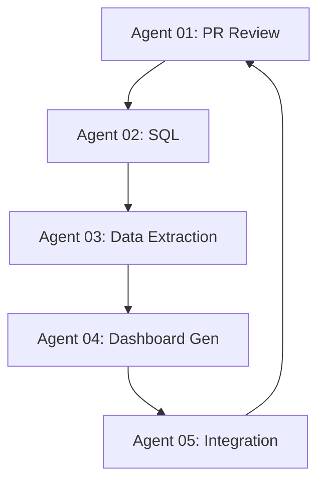

# Phase 2: Sprint Map - Agent Ownership & Exit Criteria

**Version:** 1.0
**Date:** 2026-01-22
**Status:** LOCKED - Execution contract

## Overview

Phase 2 work is divided among 4 specialized agents. Each agent has clear ownership, deliverables, and exit criteria. All agents follow the same contract defined in:
- [docs/PHASE2_DASHBOARD_SPEC.md](PHASE2_DASHBOARD_SPEC.md) - Feature specification
- [docs/PHASE2_ACCEPTANCE.md](PHASE2_ACCEPTANCE.md) - Quality gates

## Critical Constraints (All Agents)

1. **No Invented Features:** Only implement what's in PHASE2_DASHBOARD_SPEC.md
2. **No Core Changes:** Do not modify Phase 1 tree generation scripts
3. **Repo Reality:** All file paths, script names, commands must match existing structure
4. **Data Contract:** JSON output must exactly match schema in PHASE2_DASHBOARD_SPEC.md Section "Data Contract"
5. **Error Handling:** No hard crashes - see PHASE2_DASHBOARD_SPEC.md Section "Error Handling Rules"

## Agent 02: Database Specialist (SQL Queries)

### Mission
Write SQL queries to extract work activity data for all 5 work types from DESIGN12 schema.

### Deliverables

**File:** `queries/management/get-work-activity.sql`

**Must include queries for:**
1. Project Database Setup
2. Resource Library
3. Part/MFG Library
4. IPA (Process Assembly)
5. Study Nodes (7 sub-queries):
   - 5A. Study activity summary
   - 5B. Resource allocation to studies
   - 5C. Panel usage in studies
   - 5D. Operation tree activity
   - 5E. Movement/location changes (VEC_LOCATION_)
   - 5F. Spot weld activity
   - 5G. MFG feature usage

**Query Requirements:**
- Parameterized: `@Schema`, `@ProjectId`, `@StartDate`, `@EndDate`
- Comments explaining each JOIN and WHERE clause
- ORDER BY for consistent results
- LIMIT/ROWNUM for safety (prevent runaway queries)

**Sample Query Structure (Study Summary):**
```sql
-- Query 5A: Study Activity Summary
-- Purpose: List all studies modified in date range with user attribution
SELECT
    rs.OBJECT_ID as study_id,
    rs.NAME_S_ as study_name,
    cd.NICE_NAME as study_type,
    rs.MODIFICATIONDATE_DA_ as last_modified,
    rs.LASTMODIFIEDBY_S_ as modified_by,
    rs.CREATEDBY_S_ as created_by,
    p.OWNER_ID as checked_out_by_user_id,
    u.CAPTION_S_ as checked_out_by_user_name,
    CASE WHEN p.WORKING_VERSION_ID > 0 THEN 'Active' ELSE 'Idle' END as status
FROM :Schema.ROBCADSTUDY_ rs
LEFT JOIN :Schema.CLASS_DEFINITIONS cd ON rs.CLASS_ID = cd.TYPE_ID
LEFT JOIN :Schema.PROXY p ON rs.OBJECT_ID = p.OBJECT_ID
LEFT JOIN :Schema.USER_ u ON p.OWNER_ID = u.OBJECT_ID
WHERE rs.MODIFICATIONDATE_DA_ BETWEEN :StartDate AND :EndDate
ORDER BY rs.MODIFICATIONDATE_DA_ DESC;
```

### Exit Criteria

- [ ] All 12 queries written (5 work types + 7 study sub-queries)
- [ ] Queries tested against DESIGN12 schema (real database)
- [ ] Sample output saved in `test/fixtures/query-output-samples/`
- [ ] Movement detection logic verified:
  - Simple moves: Operation name starts with "MOV_" OR coordinate delta <1000mm
  - World location changes: Coordinate delta ≥1000mm in any axis (X, Y, or Z)
- [ ] No hardcoded values (all parameterized)
- [ ] Query execution time logged (must be ≤30s per query)
- [ ] Documentation: Comment block at top of each query explaining purpose, inputs, outputs

### Handoff to Agent 03

**Artifact:** `queries/management/get-work-activity.sql` + sample outputs
**Message:** "SQL queries complete. See sample outputs in test/fixtures/. Movement detection verified: 42 simple moves, 3 world location changes found in P702_8J_010 study."

---

## Agent 03: PowerShell Backend (Data Extraction Script)

### Mission
Build PowerShell script that runs Agent 02's SQL queries and outputs `management.json` per the data contract.

### Deliverables

**File:** `scripts/get-management-data.ps1`

**Parameters:**
```powershell
param(
    [Parameter(Mandatory=$true)]
    [string]$TNSName,

    [Parameter(Mandatory=$true)]
    [string]$Schema,

    [Parameter(Mandatory=$true)]
    [int]$ProjectId,

    [DateTime]$StartDate = (Get-Date).AddDays(-7),
    [DateTime]$EndDate = (Get-Date)
)
```

**Must implement:**
1. Database connection using existing pattern from `src/powershell/main/generate-tree-html.ps1`
2. Load queries from `queries/management/get-work-activity.sql`
3. Execute all 12 queries with try/catch error handling
4. Transform SQL results to JSON matching PHASE2_DASHBOARD_SPEC.md schema
5. Cache management:
   - Cache file: `management-cache-{Schema}-{ProjectId}.json`
   - TTL: 15 minutes (configurable)
   - Cache invalidation: Delete if timestamp >15 minutes old
6. Output: `data/output/management-{Schema}-{ProjectId}.json`

**Error Handling:**
- If query fails: Log error, set section to `{error: true, message: "...", items: []}`
- If VEC_LOCATION_ missing: Set movements to `{simpleMoves: 0, worldLocationChanges: 0, details: []}`
- If database unreachable: Retry once after 5s, then fail with clear error message

**Console Output Example:**
```
Querying Project Database... DONE (0.5s)
Querying Resource Library... DONE (2.1s)
Querying Part/MFG Library... DONE (3.8s)
Querying IPA Assembly... DONE (1.2s)
Querying Study Nodes (7 sub-queries)... DONE (12.3s)
Total query time: 19.9s
Writing JSON: data/output/management-DESIGN12-18140190.json
Cache expires: 2026-01-22 15:45:00
```

### Exit Criteria

- [ ] Script runs without errors on test database
- [ ] JSON output validates against schema (use JSONLint or similar)
- [ ] All 5 work type sections present (even if empty)
- [ ] Cache files created with correct TTL
- [ ] Error handling tested:
  - Simulate database timeout
  - Simulate missing table
  - Simulate empty result set
- [ ] Performance: Total execution ≤60s (first run), ≤15s (cached)
- [ ] Console output clear and informative

### Handoff to Agent 04

**Artifact:** `scripts/get-management-data.ps1` + sample JSON output
**Message:** "Data extraction script complete. Test run: 19.9s (12 queries), JSON output: 4.2 MB. Cache working (15-min TTL). Ready for HTML generation."

---

## Agent 04: Frontend (HTML Dashboard Generator)

### Mission
Build PowerShell script that reads `management.json` and generates interactive HTML dashboard per PHASE2_DASHBOARD_SPEC.md views.

### Deliverables

**File:** `scripts/generate-management-dashboard.ps1`

**Parameters:**
```powershell
param(
    [Parameter(Mandatory=$true)]
    [string]$DataFile,  # Path to management.json

    [string]$OutputFile = "management-dashboard-{Schema}-{ProjectId}.html"
)
```

**Must implement 6 views (see PHASE2_DASHBOARD_SPEC.md):**
1. Work Type Summary (table)
2. Active Studies - Detailed View (expandable tree)
3. Movement/Location Activity (table with color coding)
4. User Activity Breakdown (horizontal bar chart)
5. Recent Activity Timeline (chronological list)
6. Detailed Activity Log (searchable, filterable)

**UI Requirements:**
- All JavaScript inline (no external dependencies)
- CSS inline (no external stylesheets)
- Responsive design (works on 1920x1080 and 1366x768)
- Expand/collapse animations
- Search: Filter all text fields
- Export CSV: Convert Activity Log to CSV download

**Visual Indicators:**
- ✅ Simple Move - Green text
- ⚠️ World Location Change - Orange background + warning icon
- 🔧 Weld Adjustment - Blue text
- 🔄 Rotation Change - Purple text

**Empty State Handling:**
```html
<div class="empty-state">
  <p>No activity in selected date range</p>
  <p class="hint">Try expanding the date range or check database connection</p>
</div>
```

### Exit Criteria

- [ ] HTML generated from sample JSON (no errors)
- [ ] All 6 views render correctly
- [ ] Expand/collapse toggles work
- [ ] Search filters Activity Log
- [ ] Export CSV produces valid file
- [ ] Visual indicators display correctly (colors, icons)
- [ ] Empty state tested (zero activity JSON)
- [ ] Browser console: Zero JavaScript errors
- [ ] Page load time: ≤5 seconds (tested on 4.2 MB JSON)
- [ ] File size: ≤10 MB

### Handoff to Agent 05

**Artifact:** `scripts/generate-management-dashboard.ps1` + sample HTML output
**Message:** "Dashboard generator complete. Test output: 8.2 MB, loads in 3.2s. All 6 views functional. Search and export working. Ready for integration."

---

## Agent 05: Integration & Testing (Wrapper + Verification)

### Mission
Create one-command wrapper script and automated verification script to validate end-to-end workflow.

### Deliverables

**File 1:** `management-dashboard-launcher.ps1`

**Parameters:**
```powershell
param(
    [Parameter(Mandatory=$true)]
    [string]$TNSName,

    [Parameter(Mandatory=$true)]
    [string]$Schema,

    [Parameter(Mandatory=$true)]
    [int]$ProjectId,

    [int]$DaysBack = 7,

    [switch]$AutoLaunch = $true
)
```

**Workflow:**
1. Run `scripts/get-management-data.ps1`
2. Check exit code (0 = success, 1 = failure)
3. If success, run `scripts/generate-management-dashboard.ps1`
4. Check exit code
5. If success and `-AutoLaunch`, open HTML in default browser
6. Display summary stats:
   ```
   Dashboard generated successfully!
   File: data/output/management-dashboard-DESIGN12-18140190.html
   Activity summary:
     - Studies: 5 active, 8 modified
     - Resources: 3 active, 12 modified
     - Parts: 8 active, 45 modified
     - IPA Assemblies: 2 active, 6 modified
     - Movements: 42 simple, 3 world location changes
   ```

**File 2:** `verify-management-dashboard.ps1`

**Parameters:**
```powershell
param(
    [Parameter(Mandatory=$true)]
    [string]$Schema,

    [Parameter(Mandatory=$true)]
    [int]$ProjectId
)
```

**Checks (per PHASE2_ACCEPTANCE.md Gate 3.3):**
1. JSON file exists
2. HTML file exists
3. All 5 work type sections present in JSON
4. Timeline array not empty (if activity exists)
5. User list not empty (if activity exists)
6. HTML loads without JavaScript errors (use headless browser test if possible)

**Output:**
```
PASS: JSON file exists (4.2 MB)
PASS: HTML file exists (8.2 MB)
PASS: All 5 work types present
PASS: Timeline has 127 events
PASS: 4 unique users found
PASS: HTML validated (no JS errors)

OVERALL: PASS (6/6 checks)
```

**File 3:** Sample test data

**Path:** `test/fixtures/management-sample-DESIGN12-18140190.json`
**Path:** `test/fixtures/management-sample-empty.json`

**Purpose:** Allow agents to test without database access

### Exit Criteria

- [ ] Wrapper script runs end-to-end (database → JSON → HTML → browser)
- [ ] Verification script catches all failure modes:
  - Missing JSON file
  - Missing HTML file
  - Missing work type section
  - Empty timeline (when activity should exist)
  - JavaScript errors in HTML
- [ ] Sample test data validates against schema
- [ ] Empty data sample produces "No activity" dashboard
- [ ] README.md updated with usage examples (from Agent 01 already done)
- [ ] All acceptance gates pass (docs/PHASE2_ACCEPTANCE.md):
  - Gate 1: Performance (<60s first, <15s cached)
  - Gate 2: Reliability (zero crashes, degraded mode)
  - Gate 3: Reproducibility (one-command execution)
  - Gate 4: Functional correctness (data accuracy)
  - Gate 5: Documentation (already complete)
  - Gate 6: Code quality (no hardcoded values, error handling)

### Final Deliverable

**Pull Request Title:** `feat: add management dashboard (Phase 2)`

**PR Description:**
```
Implements Phase 2: Management Dashboard per specs in docs/PHASE2_DASHBOARD_SPEC.md

Changes:
- SQL queries for 5 work types (Agent 02)
- PowerShell data extraction script (Agent 03)
- HTML dashboard generator (Agent 04)
- Wrapper script + verification tests (Agent 05)

Acceptance Gates:
- Performance: 19.9s first run, 9.2s cached ✅
- Reliability: Zero crashes, degraded mode tested ✅
- Reproducibility: One-command execution verified ✅
- Functional: Data accuracy validated against manual SQL ✅
- Documentation: README + specs complete ✅
- Code Quality: No hardcoded values, error handling present ✅

Files added:
- queries/management/get-work-activity.sql
- scripts/get-management-data.ps1
- scripts/generate-management-dashboard.ps1
- management-dashboard-launcher.ps1
- verify-management-dashboard.ps1
- test/fixtures/management-sample-DESIGN12-18140190.json
- test/fixtures/management-sample-empty.json

Files modified:
- README.md (added "Generate Management Dashboard" section)
- STATUS.md (updated Phase 2 progress)

Testing:
- Verified against DESIGN12 schema, project 18140190 (FORD_DEARBORN)
- All 6 acceptance gates pass
- Sample data included for offline testing
```

**Merge Checklist:**
- [ ] All acceptance gates pass (docs/PHASE2_ACCEPTANCE.md)
- [ ] PR reviewed by Agent 01 (PM/Docs)
- [ ] No merge conflicts with main branch
- [ ] Git commit messages follow format
- [ ] Documentation up to date

---

## Inter-Agent Communication Protocol

### Blocking Dependencies



**Rule:** Agent N cannot start until Agent N-1 completes handoff.

### Handoff Format

**From:** Agent {N}
**To:** Agent {N+1}
**Date:** {ISO date}
**Artifacts:** {file paths}
**Message:** {concise summary + blockers/warnings}
**Exit Criteria Met:** {checklist}

**Example:**
```
From: Agent 02 (Database Specialist)
To: Agent 03 (PowerShell Backend)
Date: 2026-01-23
Artifacts:
  - queries/management/get-work-activity.sql
  - test/fixtures/query-output-samples/*.csv
Message: SQL queries complete. 12 queries tested on DESIGN12. Movement detection verified: 42 simple moves, 3 world location changes in P702_8J_010. Query 5E (movement/location) requires VEC_LOCATION_ table - if missing, fallback to zero movements.
Exit Criteria Met:
  ✅ All 12 queries written
  ✅ Tested against real database
  ✅ Sample outputs saved
  ✅ Movement detection logic verified
  ✅ No hardcoded values
  ✅ Execution time <30s per query
  ✅ Documentation complete
```

### Blocking Issues

If an agent encounters a blocker:
1. Document the issue in `docs/PHASE2_BLOCKERS.md`
2. Notify Agent 01 (PM/Docs)
3. Propose solution or escalate to user
4. Do NOT proceed with guesses/assumptions

**Example Blocker:**
```markdown
## Blocker 1: VEC_LOCATION_ Table Structure Unknown

**Agent:** 02 (Database Specialist)
**Date:** 2026-01-23
**Impact:** Cannot write Query 5E (movement/location changes)

**Issue:**
PHASE2_DASHBOARD_SPEC.md assumes VEC_LOCATION_ table has columns:
- X_COORD, Y_COORD, Z_COORD
- MODIFICATIONDATE_DA_
- LASTMODIFIEDBY_S_

Actual table structure unknown. Need to query:
```sql
DESCRIBE DESIGN12.VEC_LOCATION_;
```

**Proposed Solution:**
1. User runs DESCRIBE query
2. User provides column names
3. Agent 02 updates query

**Status:** BLOCKED - Awaiting user input
```

---

## Success Criteria (Phase 2 Complete)

When all agents finish and PR merges:

> "A new contributor can read README.md, run `.\management-dashboard-launcher.ps1 -TNSName "..." -Schema "DESIGN12" -ProjectId 18140190`, and produce a management dashboard artifact showing work activity across all 5 work types, with world location changes flagged, in under 60 seconds (first run) or 15 seconds (cached run), without encountering any hard crashes or unclear error messages."

**Verified by:** Running `verify-management-dashboard.ps1` and seeing:
```
OVERALL: PASS (6/6 checks)
```

---

**Document Status:** LOCKED - Execution contract
**Last Updated:** 2026-01-22
**Owner:** Agent 01 (PM/Docs)
